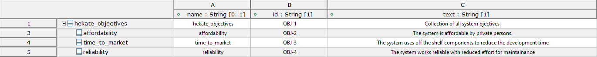

# System Architecture
Hekate system model is described in SysML using the SYSMOD as a modeling method.

## Problem Statement
How can IoT device messages forwarded into the cloud with an affordable price and self-sufficient power supply?

## System Idea
**Hekate** is Outdoor LoRa Gateway with low power consumption based on a Raspberry Pi Pico.
The system is equipped with a low power cellular transceiver to have an internet connection via the cellular network.

Main features of **Hekate** are:
* Low power consumption
* Low Bill of Material (BOM) costs
* The Things Stacks as LoRaWAN Network Server
* Secure transmitting with state-of-the-art "LoRa Basics™ Station" protocol

## System Objectives

## Stakeholder

## Base architecture

### Brief description
The hekate system will have 
* Internet, Cellular Network
* LoRa Devices
* Power Supply, Battery
* LoRaWAN Network Server

### Architecture Decisions
* The LoRaWAN Network Server will be "The Things Network"
* The Power supply will be a battery that is recharged by a solar panel.

