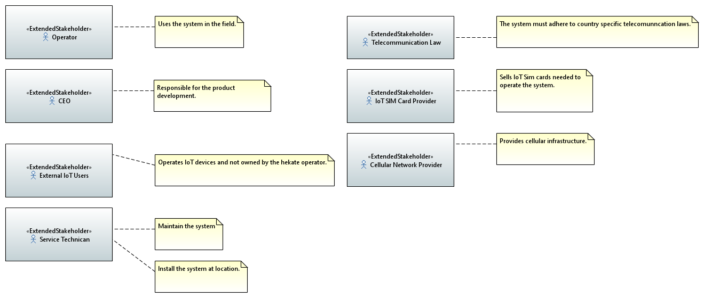
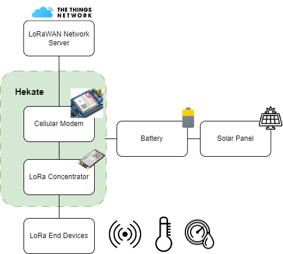

# System Architecture
Hekate system model is described in SysML using SYSMOD as a modeling methodology.

## Problem Statement

How can LoRaWAN Devices be accessed in a rural environment?

## System Idea
**Hekate** is Outdoor LoRa Gateway with low power consumption and low Bill of Material cost.
The system is equipped with a cellular modem to enable internet connection via the mobile network.

Main features of **Hekate** are:
* Supports secure transmitting with state-of-the-art "LoRa Basics™ Station" protocol
* Low maintenance
* Low cost

## System Objectives

[Objectives](./generated/objectives.md)

## Stakeholder

## Base Architecture

The hekate system consists of a **LoRa Concentrator** that is sending and receiving messages from/towards multiple **LoRa End Devices** such as Sensors. Hekate is powered by a **Battery** that could be powered by **Solar Panels**. The **Cellular Modem** connects to the **LoRaWAN Network Server**  using mobile network. The **LoRaWAN Network Server** manages the LoRaWAN Network.

### Architecture Decisions
* The LoRaWAN Network Server is provided by "The Things Network"
* The Power supply is a battery that is recharged by a solar panel.
* The Battery is external and not part of the system.
* There is a MCU needed that is not shown in the diagram.
* A LoRa Concentrator is needed to allow multiple spreading factors and channels.

### Model of Base Architecture

## Risks

## Requirements

## System Context

## System Use Cases

## System Processes

## Use Case Activities

## Domain Knowledge

## Test Cases

## Logical Architecture

## Product Architecture

## Scenarios

## System States

## Test Architecture

